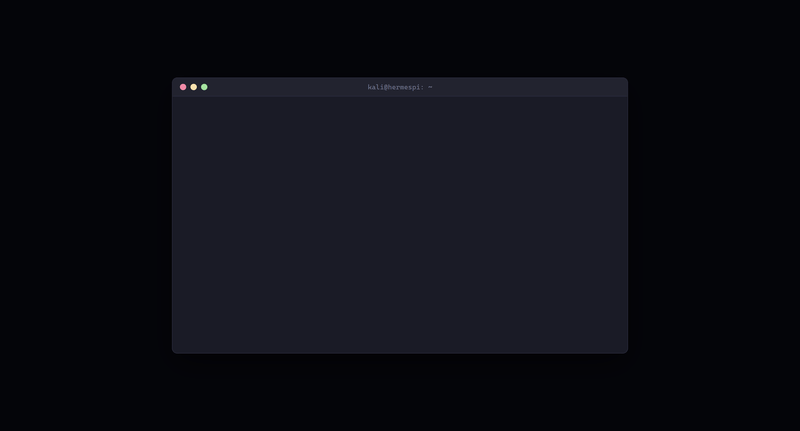

# tmux-alwayson

Keep Claude Code, Gemini CLI, OpenCode, Codex CLI, and other AI coding
agents running in tmux alive across reboots — one command instead of a
dozen manual steps.

```bash
go install github.com/nahidspace/tmux-alwayson/cmd/tmux-alwayson@latest
tmux-alwayson install
tmux-alwayson status
```



## What `install` does

Clones [TPM](https://github.com/tmux-plugins/tpm) +
[`tmux-resurrect`](https://github.com/tmux-plugins/tmux-resurrect) +
[`tmux-continuum`](https://github.com/tmux-plugins/tmux-continuum) + the
agent-detection hooks from
[`tmux-assistant-resurrect`](https://github.com/nahidspace/tmux-assistant-resurrect),
wires up `~/.tmux.conf`, and installs three `systemd --user` units: tmux
starts on boot, saves on shutdown, and saves again every 5 minutes.
`loginctl enable-linger` so it all works with nobody logged in. Idempotent
— safe to run again. `tmux-alwayson uninstall [--purge]` undoes it.

## Why not just the plugins' own defaults

- `tmux-resurrect` kills a session literally named `0` after restoring —
  fatal when `0` is the *only* session, which a bare boot placeholder is.
  Fixed with a real name.
- `systemd`'s `Type=forking` PID-guessing is flaky under boot-time load.
  Fixed with `Type=oneshot` + `RemainAfterExit=yes`.
- `tmux-continuum`'s autosave is a backgrounded status-bar job, not
  guaranteed to finish. Fixed with a systemd timer that saves directly, plus
  a guard that rejects an empty/bad save and repairs a stale session ID
  before a restore ever sees it.

All three were found by actually rebooting a real box, not by reading the
source and assuming.

## Supported agents

```go
type Agent interface {
	Name() string
	Matches(cmdline string) bool
	ValidSession(sessionID, cwd string) bool
	NewestSession(cwd string) (id string, ok bool)
	ResumeCommand(sessionID string, extraArgs []string) []string
}
```

| Agent | Detection wired up | Live-verified |
|---|---|---|
| Claude Code | yes | yes — including a real unplanned reboot |
| OpenCode, Codex CLI, Pi, Oh My Pi, Grok | yes | no |
| Gemini CLI, Qwen Code, Hermes Agent | not yet | no |

"Wired up" means the bash hooks already detect that agent in a pane and
hand this tool a session ID to validate. The three "not yet" agents have a
working `Agent` implementation with no detection feeding it yet — add that
via the bash hooks or `Matches()`. Adding any new agent is implementing
this interface once and registering it in `cmd/tmux-alwayson/main.go`.

## Known limits

- Sudden power loss (not `sudo reboot`) can lose up to one save interval
  (5 min) — inherent to any interval-based save, though the guard means the
  save itself is never corrupted or silently empty.
- Claude Code's one-time "trust this folder" prompt still needs a keypress.
